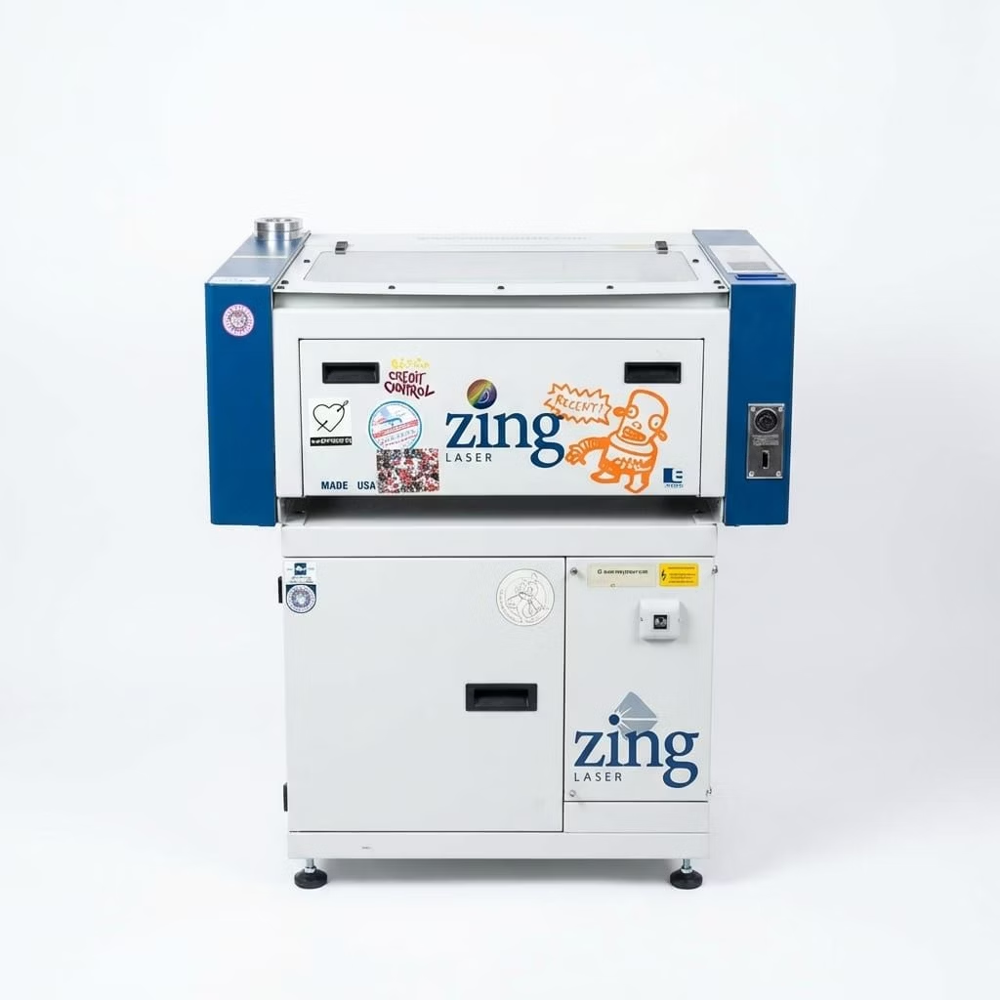

# Epilog Zing for Rayforge

Send laser jobs from [Rayforge](https://github.com/barebaric/rayforge) to an
**Epilog Zing 24 / Zing 6030** over Ethernet. Prepare your design in Rayforge,
upload it to the laser, and start the job at the machine.

<p align="center">
  
</p>

## Getting started

1. In Rayforge’s add-on manager, install from the repository URL below.
2. Enable **Epilog Zing** and restart Rayforge.
3. Add a machine using the **Epilog Zing 24 (6030)** profile.
4. Enter your laser’s hostname or IP address and use port **515**.

```text
https://github.com/konglomerat/rayforge-addon-epilog
```

The machine profile uses a **609.6 × 304.8 mm** working area with the origin
at the **top left**. Check these dimensions against your machine’s usable area.

## Send your first job

1. Import your design, or try the [10 × 10 mm rectangle](examples/rectangle-10mm.svg).
2. Set the power and speed for your material, check placement, and calculate
   the job.
3. Choose **Upload to Epilog** in the toolbar or Tools menu.
4. Select the uploaded job on the laser’s control panel and press **Go**.

Use **Upload to Epilog** even if Rayforge’s standard Send button is greyed out.
A completed upload means the file has reached the laser; it does not indicate
that cutting has finished. Start, pause, and stop jobs at the machine.

The example SVG contains geometry only. Choose material settings in Rayforge
before uploading it.

## Features

- Vector cutting and engraving over Ethernet.
- Adjustable power, speed, resolution, and vector frequency.
- Curves converted to linear cutting paths.
- Rayforge engraving scan paths converted to vectors.
- Working-area validation and upload error reporting.

### Job settings

| Setting | Values |
| --- | --- |
| Resolution | 100, 200, 250, 400, 500, or 1000 DPI |
| Vector frequency | 10–5000 |
| Power | Epilog percentage scale |
| Speed | Percentage of the configured Maximum Cut Speed |

With the default profile, **6000 mm/min corresponds to 100% Epilog speed**;
600 mm/min corresponds to 10%. This value is a conversion reference, not a
measured physical travel speed.

### Machine controls

Set focus and air assist manually. Automatic focus, Z-axis movement, rotary
operation, remote homing/jogging, and live machine status are not supported.
Engraving uses vector paths rather than native Epilog raster commands, which
can produce large jobs.

If an upload is interrupted, check the laser’s job list before sending again.
The add-on does not automatically retry interrupted uploads.

## Contributing

Bug reports and contributions are welcome. See [CONTRIBUTING.md](CONTRIBUTING.md)
for development setup, compatibility details, and hardware validation.

## Acknowledgements

The protocol implementation was informed by
[VisiCut](https://github.com/t-oster/VisiCut) and
[LibLaserCut](https://github.com/t-oster/LibLaserCut). No LibLaserCut Java code
or dependency is bundled with this add-on.

For machine operation, refer to the
[Epilog Zing manual](https://www.epiloglaser.com/de/assets/downloads/manuals/zing-manual-web.pdf).

A community project maintained in [Konglomerat](https://github.com/konglomerat).
Licensed under [MIT](LICENSE); see [NOTICE](NOTICE) for attribution.
